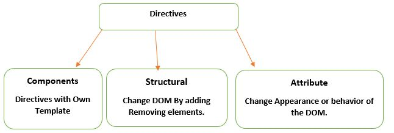

## Installing Angular CLI
npm install -g @angular/cli

## Creating a WebApp
ng new webapp

## Starting application
npm start

## package.json
    - Dependency => Required on the server we host the application
    - DevDependency => Required on the Dev machine

zone.js => Agent tells the angular when the UI needs to be refreshed
rxjs => Reactive component for JS (Data Transfer between components)
~ => Latest Stable versions (Remove all special characters from file)

To generate a component using CLI
Syntax : ng generate component <Component base folder>/<Component name>
e.g. to create eshop :
ng generate component components/eshop


## ngZone

## Monkey Patching

```//http://collabedit.com/9xr4d

var fn = document.body.addEventListener;

document.body.addEventListener = function(eventName,eventCb) {
  
    function monkeyPatched()
    {
        console.log("Hacked");
        eventCb();
    }
  
    fn(eventName,monkeyPatched);
};

document.body.addEventListener(
    "click", 
    function() { console.log("Clicked") }
    );

```


Comp OnPush  with a hierarchy os A > B > C
Making B as OnPush makes C as OnPush as well

Comp A  -> OnPush

Comp B -> OnPush

Comp C -> 


## Types of Directives


### 1. Structural
Structural Directives are directives which change the structure of the DOM by adding or removing elements.

There are three built in structural directives, *NgIf, *NgFor and *NgSwitch.

### 2. Attribute

### 3. Component


## Creating a Service
1. Create a data.service.ts
2. Mark as Injectable
3. Add to app.module.ts Provider (By default Singleton Per module is created) 
